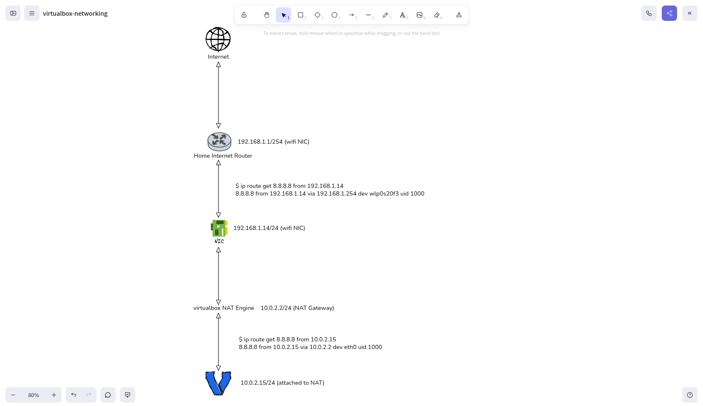

### How your VM got the ip address `10.0.2.15` 
* Since your Vagrantfile doesn't specify any network configuration, Vagrant uses VirtualBox's default NAT (Network Address Translation) mode.
* IP Assignment as below:
    * 10.0.2.0/24 is VirtualBox's default NAT network subnet
    * 10.0.2.2 is the NAT gateway (VirtualBox's internal router)
    * 10.0.2.3 is the DNS server (also provided by VirtualBox)
    * 10.0.2.15 is assigned by VirtualBox's built-in DHCP server (starts from .15 for the first VM)

### Internet Access Flow
1. Your VM sends packets to the default gateway (10.0.2.2)
2. VirtualBox's NAT Engine service translates the source IP address.
3. Packets are forwarded through your Host machine's network interface
4. Your host machine routes them to the internet via its own gateway
5. Return traffic follows the reverse path with address translation

### Verify the Network Interfaces and IP Addresses
```
vagrant@devbox01:~$ ip addr
1: lo: <LOOPBACK,UP,LOWER_UP> mtu 65536 qdisc noqueue state UNKNOWN group default qlen 1000
    link/loopback 00:00:00:00:00:00 brd 00:00:00:00:00:00
    inet 127.0.0.1/8 scope host lo
       valid_lft forever preferred_lft forever
    inet6 ::1/128 scope host 
       valid_lft forever preferred_lft forever
2: eth0: <BROADCAST,MULTICAST,UP,LOWER_UP> mtu 1500 qdisc fq_codel state UP group default qlen 1000
    link/ether 08:00:27:64:75:a1 brd ff:ff:ff:ff:ff:ff
    altname enp0s3
    inet 10.0.2.15/24 metric 100 brd 10.0.2.255 scope global dynamic eth0
       valid_lft 86329sec preferred_lft 86329sec
    inet6 fd17:625c:f037:2:a00:27ff:fe64:75a1/64 scope global dynamic mngtmpaddr noprefixroute 
       valid_lft 86330sec preferred_lft 14330sec
    inet6 fe80::a00:27ff:fe64:75a1/64 scope link 
       valid_lft forever preferred_lft forever
```

### Install networking related packages
```
sudo apt update -y
sudo apt install traceroute net-tools nmap -y
```

### Check the routing table
```
vagrant@devbox01:~$ route
Kernel IP routing table
Destination     Gateway         Genmask         Flags Metric Ref    Use Iface
default         10.0.2.2        0.0.0.0         UG    100    0        0 eth0
10.0.2.0        0.0.0.0         255.255.255.0   U     100    0        0 eth0
10.0.2.2        0.0.0.0         255.255.255.255 UH    100    0        0 eth0
10.0.2.3        0.0.0.0         255.255.255.255 UH    100    0        0 eth0
```
### Sample Architecture Diagram
